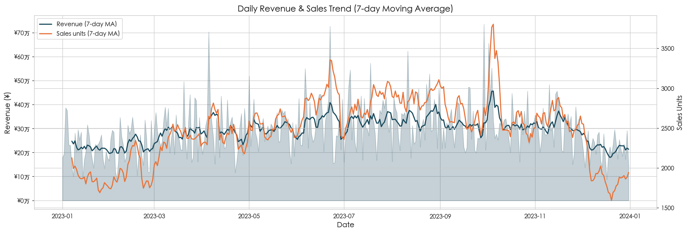
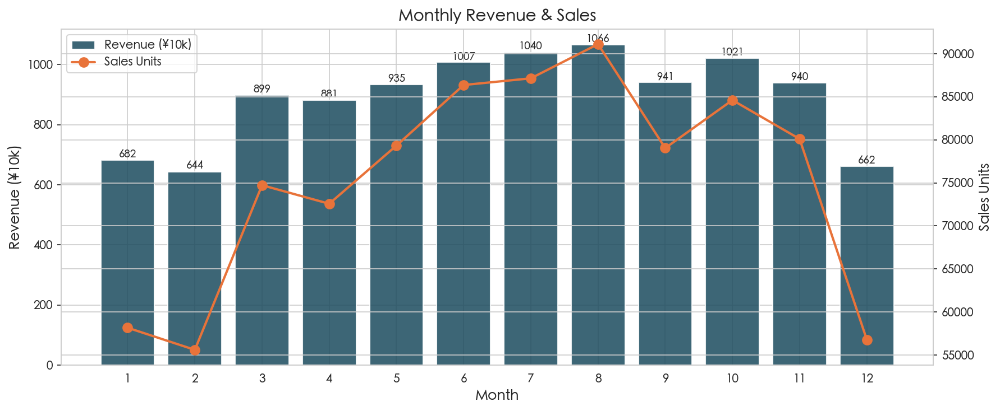
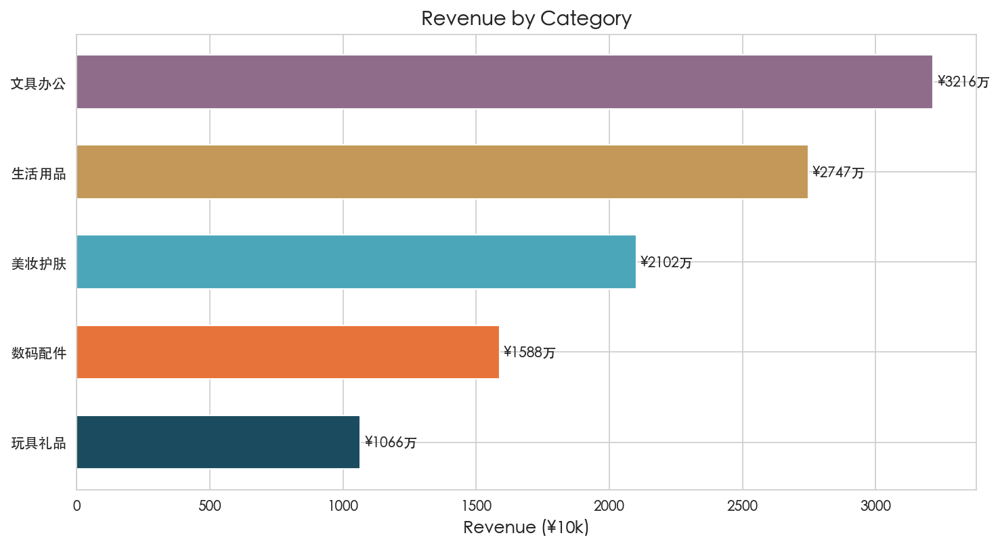
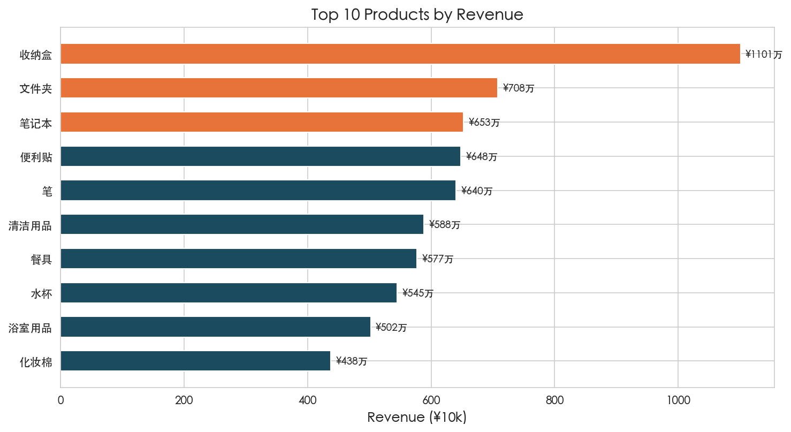
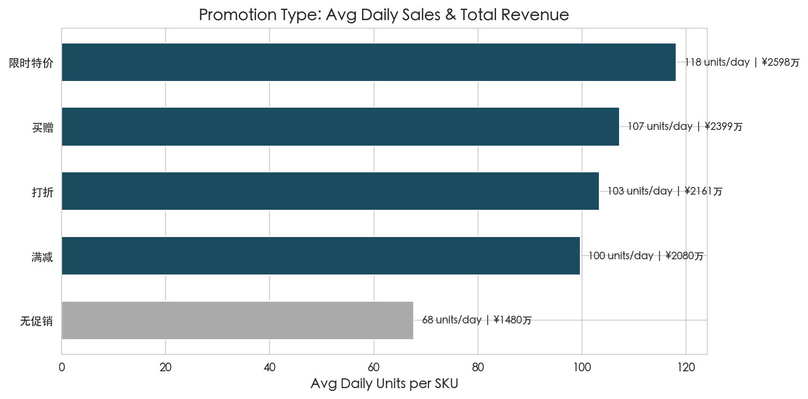
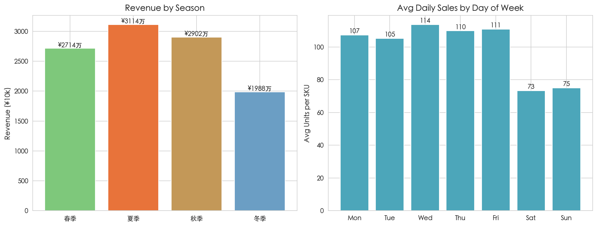
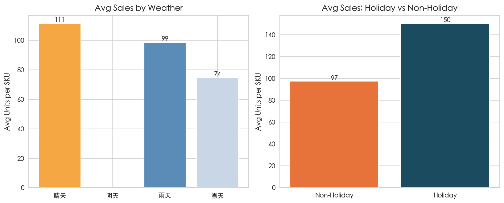
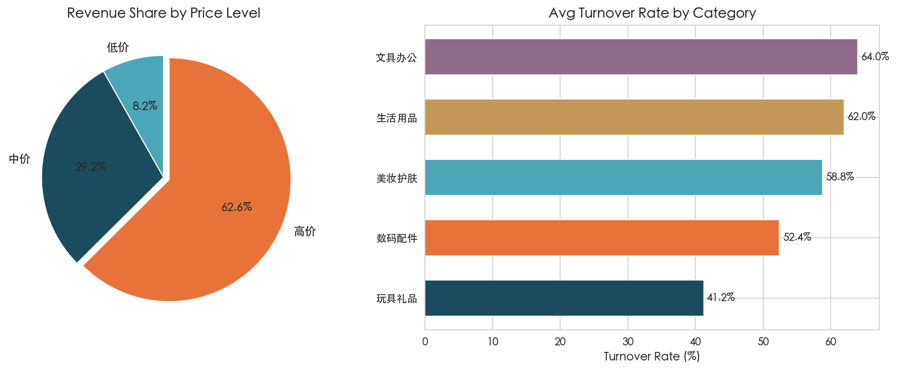

# MINISO 2023 销售数据分析与促销效果评估

> 本报告由 `analysis.py` **根据同一次加载的 DataFrame 自动生成**，与数据文件 `/Users/zhoujingjing/miniso_sales_data.csv` 及图表一致。含**数据解读**小节：其中「可能成因」为结合零售常识的**假设性解释**，非严格因果结论。生成时间：2026-05-15 12:14

---

## 一、项目概述

对 MINISO（名创优品）2023 年销售明细进行汇总分析，涵盖销售趋势、品类结构、产品表现、促销效果、季节性及外部因素等。

### 核心数据

| 指标 | 数值 |
|------|------|
| 数据时间范围 | 2023-01-01 — 2023-12-31 |
| 数据行数 | 9,125 条 |
| 品类数 | 5 个 |
| 产品数 | 24 个 |
| 全年总营收 | ¥107,174,599 |
| 全年总销量 | 905,530 件 |
| 日均营收（按自然日） | ¥293,629 |

---

## 二、销售趋势分析

### 2.1 整体走势

全年按日聚合的营收与销量见上图（含 7 日滑动平均）。

### 2.2 月度分布

| 月份 | 营收（万元） |
|---|---|
| 1月 | 682 |
| 2月 | 644 |
| 3月 | 899 |
| 4月 | 881 |
| 5月 | 935 |
| 6月 | 1007 |
| 7月 | 1040 |
| 8月 | 1066 |
| 9月 | 941 |
| 10月 | 1021 |
| 11月 | 940 |
| 12月 | 662 |

**要点（由数据自动计算）**：8月营收最高（约 **¥1066万**），2月最低（约 **¥644万**），峰谷相对差约 **65.6%**。7–12 月营收占全年约 **52.9%**。

### 2.3 数据解读与可能成因（非因果证明）

- **峰谷月份**：8月为峰值月份之一，**可能与**暑期/年末消费旺季、平台大促或企业集中备货有关；若 `promotion_type` 在该月显著升高，则「促销驱动」成分更强（可用 `analysis.py` 里 SQL 按月交叉验证）。
- **低谷月份**：2月为全年营收低谷，**常见解释**包括春节假期带来的有效营业日减少、客流结构变化等（本数据集未含「营业日数」字段，**需与门店实际排班/放假表交叉验证**）。
- **下半年占比 52.9%**：若显著高于 50%，**可能反映** Q3/Q4 促销更密、品类结构季节性更强，或样本期内下半年门店/渠道权重变化；**需排除**「仅记录天数不均」等数据构造问题（本表为逐日 SKU 级记录，仍建议核对是否含闭店日）。
- **与趋势图的关系**：日度折线若呈台阶式跳变，往往对应**大促起止**或**节假日**；若呈缓慢爬升，更像**品类/客单结构**迁移。

---

## 三、品类与产品分析

### 3.1 品类结构

| 品类 | 营收（万元） | 营收占比 | 平均售价（¥） |
|---|---|---|---|
| 文具办公 | 3216 | 30.0% | 117.0 |
| 生活用品 | 2747 | 25.6% | 122.5 |
| 美妆护肤 | 2102 | 19.6% | 116.3 |
| 数码配件 | 1588 | 14.8% | 117.4 |
| 玩具礼品 | 1066 | 9.9% | 118.0 |

**要点**：前三大品类营收占比合计 **75.2%**。

### 3.1.1 数据解读与可能成因

- **结构集中度**：第一名 **文具办公** 约占 **30.0%** 营收，说明当前盘子的「支柱品类」明确；若头部品类 ASP 同时偏高，则总营收更依赖**高客单而非纯走量**。
- **客单价差异**：品类间 ASP 最高为 **生活用品（约 ¥122.5）**，最低为 **美妆护肤（约 ¥116.3）**。差距主要反映**价格带与产品结构**，不等于利润率（毛利数据未在本集中）。
- **尾部品类**：若某品类销量大但营收排名靠后，多为**低单价走量**；反之则可能**SKU 少但件单价高**。可结合 `charts/03_category.png` 与 `09_heatmap_category_month.png` 看是否存在「单一品类拖尾月份」。

### 3.2 产品表现

- **营收 Top 3**：收纳盒（¥1101万）、文件夹（¥708万）、笔记本（¥653万）
- **营收 Bottom 3**：益智玩具（¥207万）、毛绒玩具（¥210万）、装饰品（¥212万）
- **Top 10 产品营收占全年**：约 **59.7%**

### 3.2.1 数据解读与可能成因

- **头部集中**：Top10 营收合计约 **59.7%**，说明**少数 SKU 贡献主要盘子**；运营上可优先保障头部 SKU 的库存与陈列，同时评估长尾是否过度挤占货架。
- **Bottom 产品**：低营收未必是「卖得差」，也可能是**定价低、上架时间短、或区域未铺货**；需回到原始门店/渠道维度才能下结论（本数据为汇总明细，未含门店维度）。

---

## 四、促销效果评估

### 4.1 促销类型对比

| 促销类型 | 日均销量/件 | 相比无促销提升 | 营收贡献占比 |
|---|---|---|---|
| 限时特价 | 118.1 | +74.4% | 24.2% |
| 买赠 | 107.2 | +58.3% | 22.4% |
| 打折 | 103.3 | +52.6% | 20.2% |
| 满减 | 99.7 | +47.2% | 19.4% |
| 无促销 | 67.7 | — | 13.8% |

### 4.2 小结

以「无促销」日均销量为基准，**限时特价** 的相对提升最高（约 **+74.4%**）；无促销营收占比约 **13.8%**。

### 4.3 数据解读与可能成因

- **「限时特价」为何在表观上最强**：在零售机制上，**明确底价+时间窗口**更容易触发冲动购买与比价完成；若数据里该类活动还叠加了**陈列/广告位**投入，则销量抬升是「价格+曝光」的联合结果，**不能单凭本表拆出纯价格效应**。
- **买赠 vs 打折**：若提升接近，通常体现为「感知折扣」相近；买赠对**客单价与毛利结构**的保护可能更好（仍缺成本字段，此处为经营常识推断）。
- **满减偏弱的可能原因**：门槛会**过滤小额冲动消费**；若门槛与客单分布不匹配，会出现「券看起来大、核销率低」。
- **无促销营收仍占 13.8%**：说明并非「全靠促销活着」，但促销仍是**主要增量杠杆**；可进一步按品类拆分促销 ROI（需成本与费用数据）。

---

## 五、季节性规律

### 5.1 季节分布

| 季节 | 营收（万元） | 占比 |
|---|---|---|
| 春季 | 2714 | 25.3% |
| 夏季 | 3114 | 29.1% |
| 秋季 | 2902 | 27.1% |
| 冬季 | 1988 | 18.5% |

### 5.2 星期分布

工作日（周一至周五）SKU 日均销量约 **109.4** 件，周末约 **74.1** 件；周末相对工作日约低 **32.2%**。

### 5.3 数据解读与可能成因

- **季节营收差异**：夏季/年末若占比更高，**常见解释**包括开学季文具、礼品消费、降温品类与节假日叠加；具体哪一类主导，需要按 **品类×月份** 热力图辅助判断（见 `charts/09_heatmap_category_month.png`）。
- **「周末低于工作日」**：在快消杂货业态里并不罕见，**可能机制**包括：样本对应门店位于**通勤型商圈**（工作日顺路购买）、周末客流被大型商场/线上渠道分流、或促销排期更多落在工作日。该结论依赖「记录口径 = 门店真实客流」的假设，**若数据含 ToB/团购且多在工作日结算，也会拉工作日均值**。

---

## 六、天气与节假日

### 6.1 天气（按原始字段分组）

| 天气 | 日均销量 |
|---|---|
| 多云 | 112.7 |
| 晴天 | 111.5 |
| 雨天 | 98.6 |
| 雪天 | 74.5 |

### 6.2 节假日

节假日 SKU 日均销量约 **150.3** 件，非节假日约 **97.4** 件，相对提升约 **54.4%**。

### 6.3 数据解读与可能成因

- **天气**：当前样本中，**多云** 日均销量约 **112.7** 件，**雪天** 约 **74.5** 件，极差约 **51.3%**。但天气与销量**高度容易混杂**：雨雪天可能同时伴随**促销加码、门店位置、节假日**等，本表未做多元回归或因果识别，**只能称「统计关联」**，不能写成「天气导致销量变化」。
- **节假日 +54.4%**：节假日往往叠加**促销与出行消费**；本数据中节假日记录约占 **3.6%** 行，若节假日同时是高促销期，则「节假日效应」与「促销效应」会**部分重叠**，解读时应避免重复归因。

---

## 七、价格档位与库存周转

### 7.1 价格档位营收

| 价格档位 | 营收（万元） | 占全年营收 |
|---|---|---|
| 低价 | 880 | 8.2% |
| 中价 | 3133 | 29.2% |
| 高价 | 6704 | 62.6% |

### 7.2 品类平均周转率

| 品类 | 平均周转率 |
|---|---|
| 文具办公 | 64.0% |
| 生活用品 | 62.0% |
| 美妆护肤 | 58.8% |
| 数码配件 | 52.4% |
| 玩具礼品 | 41.2% |

### 7.3 数据解读与可能成因

- **价格带结构**：**高价**档营收约 **6704 万**（占 **62.6%**），**低价**档约 **880 万**（**8.2%**）。若高价占比高，说明盘子更偏**高客单/组合购买**；若低价占比高则更偏**走量**。
- **周转**：**文具办公** 平均周转率最高（约 **64.0%**），**玩具礼品** 最低（约 **41.2%**）。周转高通常意味着**动销快或备货偏紧**，周转低可能是**高客单慢动销**或**备货偏多**；仍需结合安全库存与缺货率（本集未含）判断好坏。

---

## 八、数据校验（自动生成）

以下校验均针对本次写入报告所用的同一 `DataFrame`：

- [x] 月度营收之和 = 总营收
- [x] 品类营收之和 = 总营收
- [x] 季节营收之和 = 总营收
- [x] 品类营收占比之和 ≈ 100%
- [x] 促销类型营收占比之和 ≈ 100%

---

## 九、使用说明

重新生成图表与本报告：在项目目录执行 `python3 analysis.py`。请勿手改本文件中的数字表格；**解读性文字**可在 `analysis.py` 的 `write_analysis_report` 函数中调整模板；如需更长论述可另建 `报告附录.md`。
